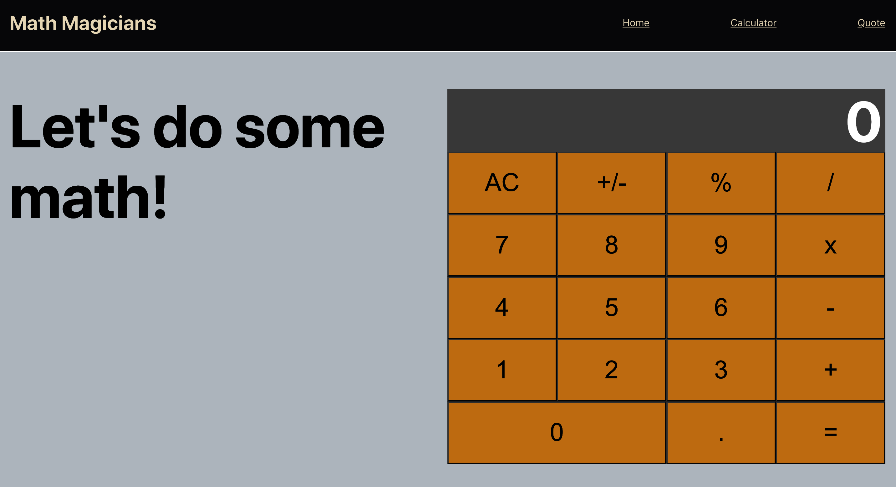

# React Calculator

> A multi-page application built with ReactJS.

This application has been built to have three different pages with one of them housing the calculator component. Routing in the browser is achieved using the react-router.

## Built With

- Javascript, JSX, CSS,
- ReactJS,
- Big.js

## Live Demo

[Live Demo Link](https://shielded-everglades-20664.herokuapp.com/)

## Getting Started

To get a local copy up and running in development mode, follow these simple steps.

### Prerequisites

- Node.js
- Browser
- Terminal

### Setup

Clone the project from [here](https://github.com/pbkabali/React-Calculator)

### Install

Run `npm install` to get all the dependencies.

Run `npm start` to start the web-server.

### Usage

Go to `https://localhost:3000` in your browser.

## Author

👤 **Paul Balitema Kabali**

- Github: [@pbkabali](https://github.com/pbkabali)
- Twitter: [@pbkabali](https://twitter.com/pbkabali)
- Linkedin: [engineerbpk](https://linkedin.com/in/engineerbpk)

## 🤝 Contributing

Contributions, issues and feature requests are welcome!

Feel free to check the [issues page](https://github.com/pbkabali/React-Calculator/issues).

## Show your support

Give a ⭐️ if you like this project!

## Acknowledgments

- Microverse Team 140 (The Cupids)
- [The Odin Project](https://opengameart.org/)

## 📝 License

This project is [MIT](https://opensource.org/licenses/MIT) licensed.
